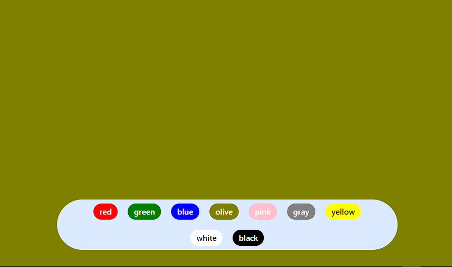
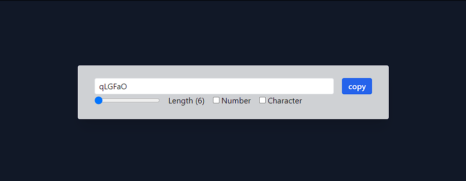
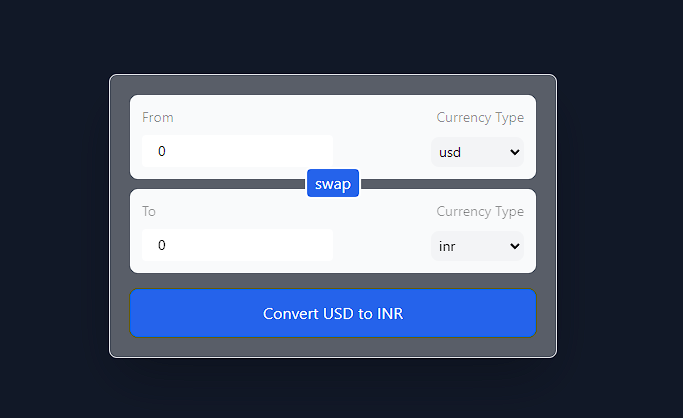

# Learning React with (chaiAurCode)

As an aspirational Full-Stack developer this(React) is one of the thing that will help me to make Web Apps to solve real-life problems.

## How to use project?

```bash
git clone https://github.com/gouravg8/react.git #clone project

cd react/day1/01vite #to enter on project folder

npm install #to install all needed dependencies

npm run dev #to start development server
```

## Day1

Setup the project

```bash
npm create vite@latest
```

> Name [project-name]  
> Choose [React]  
> Choose [language(Javascript or Typescript)]

```bash
cd project-name     # to enter on project folder/directory
npm install         # install all needed dependencies
npm run dev         # run development server for react
```

## Day2

### SPA

Web apps that are created using react are known as SPA meaning single page applications, because it only contains one and only single index.html file

And rest DOM is created using React in Jsx format

### Structure

```text
├── node_modules
├── src
│ ├── components
│ │ ├── Header.js
│ │ └── Footer.js
│ ├── App.js
│ └── index.js
├── public
│ ├── style.css
│ └── favicon.ico
├── package.json
└── index.html
```

### Fragment

- it is an empty tag to wrap up the multiple elements inside it
- empty tag/fragment does not create a new node on the DOM

### Components

- it is a piece of code that returns the jsx/js
- it is nothing but a function of javascript

  **Best practices**

  - component name must be start with CapitalLetter

    ```text
    App.jsx
    ```

  - it is preferred that the component containing jsx code must be initialized named with **.jsx** extension
  - **function name**, **file name** must start with CapitalLetter

## Day3

- **Transpiler/Bundler** convert the JSX code into **.js** readable format and to create the DOM from it
- We can also write component as a function

```text
<App /> also App()
```

### JSX (JavaScript eXtension)

- We can write **JS** inside the HTML
- It is **evaluated expression(final output)**
- We can't use `if-else` in JSX directly
- We can show JS variables in jsx using {curly braces}

  ```javascript
  function App() {
    let name = "Gourav soni";
    return <h1>My name is {name}</h1>;
  }
  ```

## Day4

### Hook

Hooks are the special type of JS function of React, that let us use many features of React directly from the `<Component>`

### useState()

`useState()` hook helps us to change the state(current value) of the variable, wherever it(variable) is used throughout the `<Component>`

#### syntax

```javascript
let [var, setVar] = useState(initialValue)
```

var: variable  
setVar: method to change the value of that variable  
initialValue: default/starting value of the variable

## Day5

### Virtual DOM

- React creates the tree like structure for keeping the track for changes in the UI
- It is done by the comparing both Real DOM and React's own DOM and if differences found it(React) changes and reflects on the DOM

### Fibre

- Keeping the **Track** and **updation** is done by **Fibre Algorithm**
- Key features: Pause, Abort, or reuse work as new update come in

```text
_Hydration:_ Inserting Js in HTML & CSS to make it interative and functional
```

### Reconciliation

- React algorithm Chooses what to update, When to update in the UI
- By **difference algorithm** between two **Real DOM** and **Virtual Dom**

### Why to use **Keys** in list

- **Increase Performance** by differentiating each list item to another by key
- Key should be **Stable**, **Predictable**, & **Unique**

## Day6

### React

```text
Don't segregate the code according to technology but segregate them according what the do (piece of code)
```

| Don't                                   | Do's                                 |
| --------------------------------------- | ------------------------------------ |
| Card                                    | Card                                 |
| `[index.html], [style.css],[script.js]` | `[index.html, style.css, script.js]` |

### Props

Properties send by parent components to children components in the form of objects with key/value pairs

`APP.jsx`

```javascript
<Card name='Gourav soni' age={21}>
```

`Card.jsx`  
way: 1

```javascript
function Card(props) {
  return (
    <>
      <h1>Hello {props.name}</h1>
      <p>Your age is {props.age}</p>
    </>
  );
}
```

way: 2

```javascript
function Card({ name, age }) {
  return (
    <>
      <h1>Hello {name}</h1>
      <p>Your age is {age}</p>
    </>
  );
}
```

`Note: End of React foundation`

## day7

### React interview question

Q. what will be output and how to make it working

```javascript
const [counter, setCounter] = useState(0);
const add = () => {
  setCounter(counter + 1);
  setCounter(counter + 1);
  setCounter(counter + 1);
  setCounter(counter + 1);
};
```

Answer. Fibre(algo behind react) will batch the same task with no change, and then send it once to reflect the changes

we can make it working to add +4 at one click

way: 1

```javascript
const [counter, setCounter] = useState(0);
const add = () => {
  setCounter(counter + 4);
};
```

Directly increment the counter by +4

way: 2

```javascript
const [counter, setCounter] = useState(0);
const add = () => {
  setCounter((prev) => prev + 1);
  setCounter((prev) => prev + 1);
  setCounter((prev) => prev + 1);
  setCounter((prev) => prev + 1);
};
```

In 2nd the change will happen based on it's previous value of the variable in the callback function

## day8

### Project BgChanger

This project is to test our knowledge of the useState() hook, list(key), event handlers, components etc.

Functionality:

- there are many buttons on UI which will be length of `colors` array, it can be increase or decrease accordingly depending on the value of `colors` array
- when we click on the button named colors name and then it will change the color of the main div



`BgChanger.jsx`

```javascript
function ColorTab({ setBgColor }) {
  const handleClick = (e) => setBgColor(e.target.innerText);
  const colors = ["red", "green", "blue", "yellow", "olive"];

  return (
    <div>
      {colors.map((color, idx) => (
        <button key={idx} onClick={handleClick}>
          {color}
        </button>
      ))}
    </div>
  );
}

function BgColor() {
  const [bgColor, setBgColor] = useState("olive");
  return (
    <div style={{ backgroundColor: bgColor }}>
      <ColorTab setBgColor={setBgColor} />
    </div>
  );
}
```

## day9

### useEffect, useRef, and useCallback

**Project**: a password generator which have options to increase length, add numbers, add special characters, and copy the generated password



1. useEffect: useEffect is a built-in hook in React that lets you synchronize your component with the rest of the app, by performing side effects such as data fetching, manipulating the DOM.

syntax:

```javascript
import { useEffect } from 'react';

function AnyComponentName() {
  useEffect(() => {
    // Code to run in response to state changes
  }, [dependencies]);

  return (
    // JSX code
  );
}
```

2. useRef: useRef allows you to create a mutable reference to something. It is used to access or manipulate a DOM element, this passes the reference of the element

syntax:

```javascript
import { useRef } from "react";

function AnyComponentName() {
  const myRef = useRef(initialValue);

  // JSX code
  return <div ref={myRef}>{/* JSX code */}</div>;
}
```

3. useCallback: useCallback is used to optimize the function

- optimize performance by preventing unnecessary re-renders of child components.
- takes place with dependencies

syntax:

```javascript
import { useCallback } from "react";

function AnyComponentName() {
  const handleClick = useCallback(() => {
    // Code to run when the button is clicked
  }, [dependencies]);

  return <button onClick={handleClick}>Click me</button>;
}
```

## day10

### Currency converter

This project converts one currency to another with realtime api, it contains almost all the currency types



Rest code is presented at: `day1/01vite/src/components/CurrencyConvo`

Custom hook: `useCurrencyInfo.js`

```javascript
import { useState, useEffect } from "react";

function useCurrencyInfo(currency) {
  const [data, setData] = useState({});

  useEffect(() => {
    fetch(`https://hosted-api.co/api/v1/${currency}.json`)
      .then((response) => response.json())
      .then((data) => setData(data[currency]));
  }, [currency]);

  return data;
}

export default useCurrencyInfo;
```

## day11

### React Router

```bash
npm install react-router-dom
```

| Use this ✅         | Not this ❌        |
| ------------------- | ------------------ |
| `<Link to="/home">` | `<a href="/home">` |

#### For navigation

NavLink: `<NavLink to="/home">` for seeing is this tab is active or not

```jsx
<NavLink
  to="/home"
  className={({ isActive }) => (isActive ? "text-orange-500" : "text-gray-500")}
>
  Home
</NavLink>
```

`src/Layout/` => `Header.jsx`, `Footer.jsx`, `Layout.jsx`

`Layout.jsx`:

```jsx
import { Outlet } from "react-router-dom";
import Footer from "./Footer";
import Header from "./Header";

function Layout() {
  return (
    <>
      <Header />
      <Outlet />
      <Footer />
    </>
  );
}

export default Layout;
```

`main.jsx`:

```javascript
import {
  Route,
  RouterProvider,
  createBrowserRouter,
  createRoutesFromElements,
} from "react-router-dom";

// import below components
const router = createBrowserRouter(
  createRoutesFromElements(
    <Route path="/" element={<Layout />}>
      // here we will use loader
      <Route path="" element={<Home />} loader={homeLoader} />
      <Route path="passgen" element={<PassGen />} />
      <Route path="bgchanger" element={<BgChanger />} />
      <Route path="currencyconvo" element={<CurrencyConvo />} />
    </Route>
  )
);

ReactDOM.createRoot(document.getElementById("root")).render(
  <React.StrictMode>
    <RouterProvider router={router} />
  </React.StrictMode>
);
```

`Loader`: loader in react-router-dom is used to prefetch the data, which means the data is fetched before the user visits the page, it fetched the data in the background when user hover over the link and react-router-dom understand that user is going to visit the link

```javascript
export const homeLoader = async () => {
  let response = await fetch("https://api.github.com/users/gouravg8");
  return response.json();
};

function Home() {
  let data = useLoaderData();
  return <div>{data.login}</div>; // example of loader use
}
```
